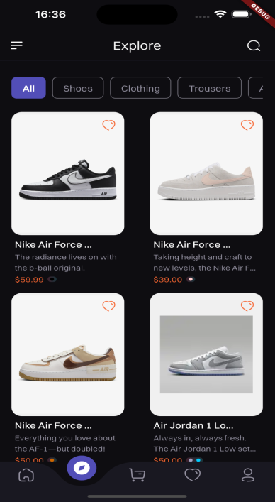
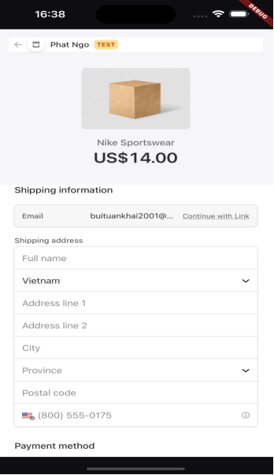
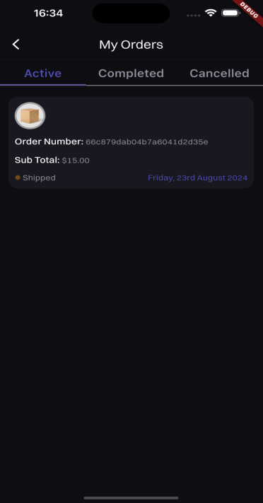
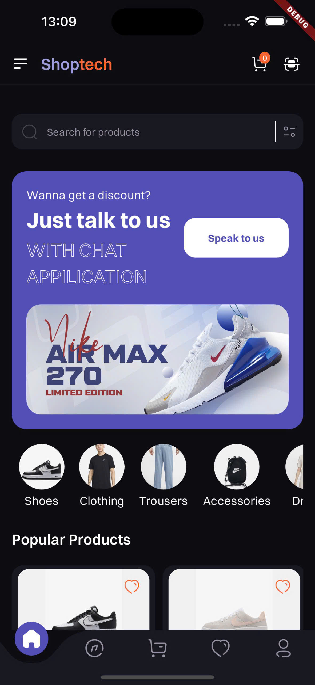
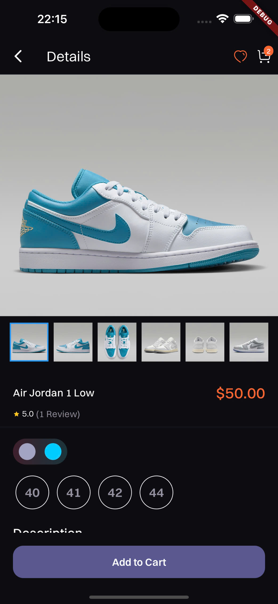
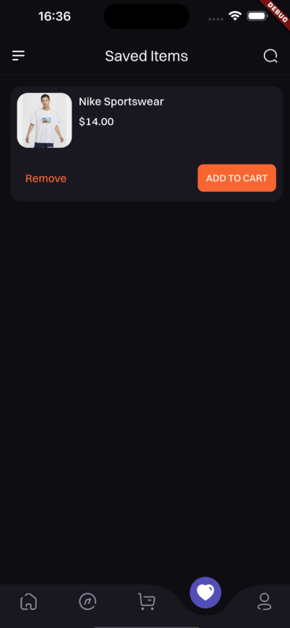

### TechShop (Ecommerce Store)

**Ứng dụng này sử dụng công nghệ API Spring boot để xây dựng phía server và sử dụng Flutter để xây dựng phía client.**

- Clean architecture với Riverpod 2.0.
- Backend MVC.
- Restful API
- Backend Spring Boot và database MongoDB.
- Cron job hệ thống ứng dụng kiểm tra các đơn hàng chưa thanh toán và xóa đơn mỗi 24 giờ

 

- Giao diện thân thiện với người dùng để trải nghiệm mua sắm mượt mà
- Tích hợp cổng thanh toán an toàn
- Tìm kiếm sản phẩm và tùy chọn lọc theo thời gian thực
- Chức năng danh sách mong muốn và giỏ hàng
- Theo dõi và lịch sử đơn hàng
- Thông báo đẩy cho cập nhật đơn hàng và khuyến mãi

  
   
    
  
  
   
    
   
  

